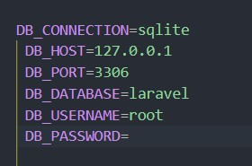

# Laravel 12 - Controladores

## ⚙️ 1. Creación del Proyecto

```php
composer create-project laravel/laravel:^12.0 controllers
```


Nos movemos a la carpeta controllers con:

```php
cd controllers
```

---

## 🌐 2. Conexión Ruta - Controlador - Vista

### 2.1 Configuración de Base de Datos (`.env`)


```env
DB_CONNECTION=sqlite
DB_HOST=127.0.0.1
DB_PORT=3306
DB_DATABASE=laravel
DB_USERNAME=root
DB_PASSWORD=
```



**Corregir fallo de la base de datos**

### 2.2 Migraciones y Modelo

- Utilizamos las del proyecto anterior
- Modelos

  
- Migraciones

  

### Migrar Base de Datos

Refrescamos las migraciones para que se carguen con los datos que hemos creado basandonos en el proyecto anterior.

```bash
php artisan migrate:refresh
```

---

## 🧠 3. Controladores

### Crear Controlador

```php
php artisan make:controller PlayerController
```


### Definir Ruta

Vamos a la ruta siguiente **routes/web.php** y modificamos lo siguiente:

```php
use App\Http\Controllers\PlayerController;

Route::get('/', [PlayerController::class, 'index'])->name('player.index');
```


### Método en Controlador

```php
public function index()
    {
        $players = Player::where('age', '>', 18)
            ->where('age', '<', 30)
            ->orderBy('name', 'asc')
            ->orderBy('age', 'desc')
            ->get();
        return view('player.index',compact('players'));
    }
```


---

## 🎨 4. Vistas con Blade

- Crear archivo `resources/views/player/index.blade.php`
  

### Enviar Datos a la Vista

```php
return view('player.index', compact('players'));
```


---

## 📋 5. Consultas con Eloquent

```php
 public function index()
    {
        $players = Player::where('age', '>', 18)
            ->where('age', '<', 30)
            ->orderBy('name', 'asc')
            ->orderBy('age', 'desc')
            ->get();
        return view('player.index',compact('players'));
    }

```

- Métodos comunes: `get()`, `first()`, `find()`, `where()`, `offset()`, `orderBy()`


---

## 🔄 6. Inserción de Datos

Podemos añadir los datos manualmente en el Controlador de Player que se encuentra en la ruta:

**/app/Controllers/PlayerController.php**

y nos vamos a la parte de **public fuction create**, para modificarla y añadirle lo siguiente:

### Manual:

```php
  Player::create([
            'name' => 'John Doe',
            'age' => 25,
            'position' => 'Shooting Guard',
            'height' => 180,
            'weight' => 75,
            'team' => 'Laker',
        ]);
```


### Con Factories:

Yo utilizé esta opción ya que podia meter mas jugadores y es más facil:

```bash
php artisan make:factory PlayerFactory
php artisan db:seed
```


Y ahora completamos el seeder con lo siguiente:

```php
public function run(): void
    {
        $faker = \Faker\Factory::create();
        foreach (range(10, 20) as $index) {
            Player::create([
                'name' => $faker->name(),
                'age' => $faker->numberBetween(18, 40),
                'position' => $faker->randomElement(['Point Guard', 'Shooting Guard', 'Small Forward', 'Power Forward', 'Center']),
                'height' => $faker->numberBetween(150, 220),
                'weight' => $faker->numberBetween(50, 100),
                'team' => $faker->randomElement(['Lakers', 'Bulls', 'Celtics', 'Warriors', 'Nets', 'Heat', 'Mavericks', 'Clippers', 'Rockets', 'Suns']),
            ]);
        }
    }
```


y volvemos a migrar los seeders para que se carge el nuestro:

```php
php artisan db:seed
```

---

## 🧰 7. Mostrar Datos en Blade

Nos vamos al **index.blade.php** y lo modificamos para que nos muestre lo siguiente:

```html
    <h1>Lista de Jugadores</h1>

    <ul>
        @forelse($players as $player)
            <li>{{ $player->name }} — Edad: {{ $player->age }} años - Posición: {{ $player->position }} - Equipo: {{ $player->team }}</li>
        @empty
            <li>No hay jugadores registrados.</li>
        @endforelse
    </ul>
```


---

## 💬 8. Consultas SQL Raw

### Explicación paso a paso

* **Obtener jugadores (`index`)**

  Se usa `DB::select('select * from players')` para ejecutar una consulta SQL que recupera todos los registros de la tabla `players`.

  El resultado se pasa a una vista llamada `player.index`.

  ```php
  public function index() {
      $players = DB::select('select * from players');
      return view('player.index', compact('players'));
  }

  ```
* **Insertar un usuario (`create`)**

  * Se hace una inserción en la tabla `player` con una consulta SQL.
  * Usa `DB::insert(DB::raw(...))` para ejecutar una sentencia `INSERT`.

```php
public function create() {
    DB::insert(DB::raw('INSERT INTO player VALUE ...'));
}

```
