# 🏀 Laravel Basketball CRUD

Este proyecto es una aplicación web básica hecha con **Laravel 12**, que permite gestionar equipos de baloncesto (`Teams`) y sus jugadores (`Players`). Cada jugador pertenece a un equipo.

---

## **1. Funcionalidades**

- CRUD completo de **Equipos**:
  - Crear, ver, editar y eliminar equipos (nombre y ciudad).
- CRUD completo de **Jugadores**:
  - Crear, ver, editar y eliminar jugadores (nombre, posición, y equipo asignado).
- Navegación amigable con menú de acceso rápido.
- Estilos personalizados usando Bootstrap + CSS adicional.
- Relación uno a muchos: un equipo tiene muchos jugadores.

## **2. Estructura de Base de Datos**

* **Migraciones** :
  Se crearon migraciones para las tablas de `teams` y `players`. Los campos principales para las tablas fueron:
  **Teams Table:**
* `name`: Nombre del equipo.
* `city`: Ciudad del equipo.

  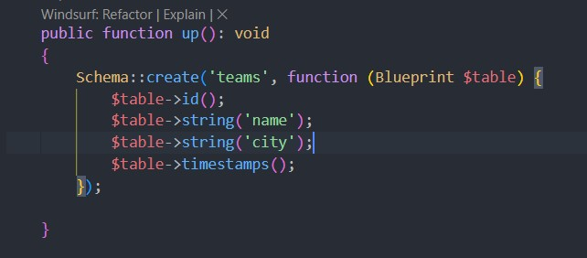

  **Players Table:**
* `name`: Nombre del jugador.
* `position`: Posición del jugador.
* `team_id`: ID del equipo al que pertenece el jugador (relación con la tabla `teams`).

  Ejemplo de migración para `teams`:

```php
Schema::create('teams', function (Blueprint $table) {
    $table->id();
    $table->string('name');
    $table->string('city');
    $table->timestamps();
});

```

 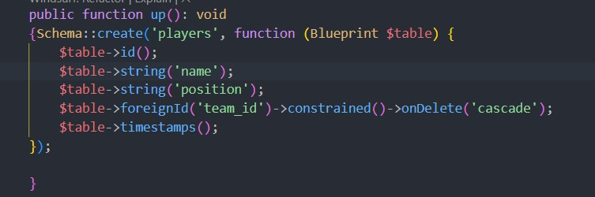

  **Relaciones** :

* Un **equipo** tiene muchos  **jugadores** , lo que implica una relación uno a muchos entre las tablas `teams` y `players`.
* **Ejecutar Migraciones** :

```php
php artisan migrate
```

## **3. Creación de Modelos y Relaciones**

* **Modelo Team** :
  Se crea el modelo `Team` que representa a un equipo de baloncesto.

```php
class Team extends Model {
    public function players() {
        return $this->hasMany(Player::class);
    }
}

```

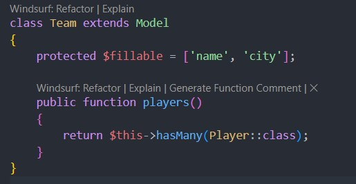

> **hasMany** : es una relación en la cual representa que un equipo puede tener muchos jugadores.

* **Modelo Player** :
  El modelo `Player` representa a un jugador, y se define la relación de un jugador con un equipo.

```php
class Player extends Model {
    public function team() {
        return $this->belongsTo(Team::class);
    }
}
```

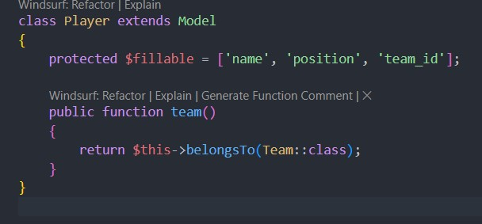

> ***belongsTo* **significa que en la tabla ***players** *existe una columna ***team_id* **que es una **clave foránea** que apunta a la tabla ***teams.***

## **4. Desarrollo de Controladores**

* **Controlador de Equipos** :
  Se crea el controlador `TeamController` para manejar las operaciones CRUD de equipos: creación, visualización, edición y eliminación.

```php
public function store(Request $request) {
    $request->validate([
        'name' => 'required|string|max:255',
        'city' => 'required|string|max:255',
    ]);
    Team::create($request->all());
    return redirect()->route('teams.index')->with('success', 'Equipo creado con éxito!');
}
```

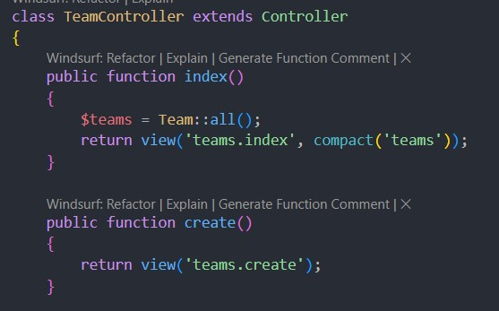

> ```php
> return view('team.index', compact ('teams)); 
> ```
>
> hace que enviemos los datos usando ***compact** * a la vista* **teams.index*** y hace que ***teams*** esté disponible en ella

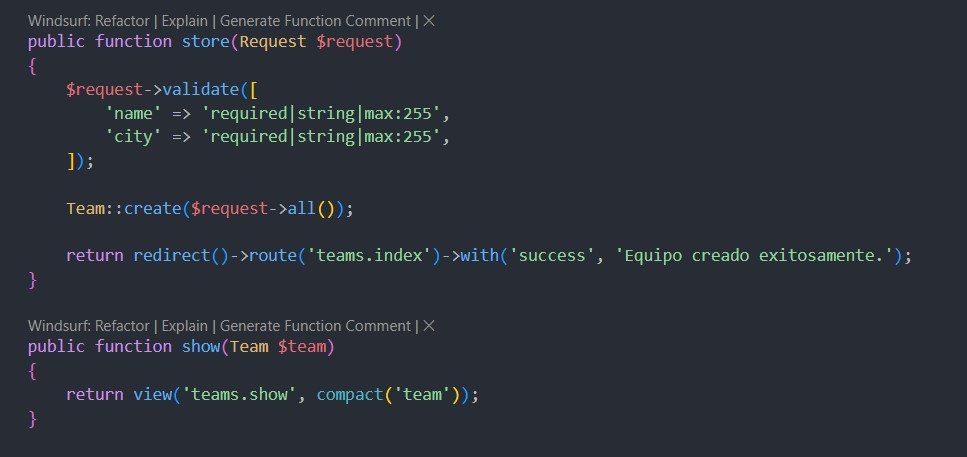

> ```php
> return redirect()-> route('teams.index')->with('success', 'Equipo creado exitosamente. ');
> ```
>
> `Lo que hace es redirigirnos a la vista teams.index con un mensaje de exito.`

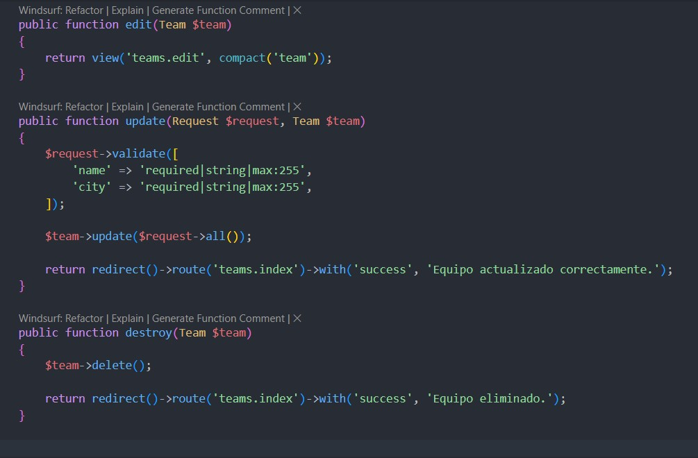

> ```php
> $team->update($request->all());
> ```
>
> Actualiza el equipo específico con los nuevos datos

* **Controlador de Jugadores** :
  El controlador `PlayerController` se utiliza para manejar las operaciones CRUD de los jugadores, asegurando que cada jugador esté vinculado a un equipo.

```php
public function store(Request $request) {
    $request->validate([
        'name' => 'required|string|max:255',
        'position' => 'required|string|max:255',
        'team_id' => 'required|exists:teams,id',
    ]);
    Player::create($request->all());
    return redirect()->route('players.index')->with('success', 'Jugador creado con éxito!');
}

```

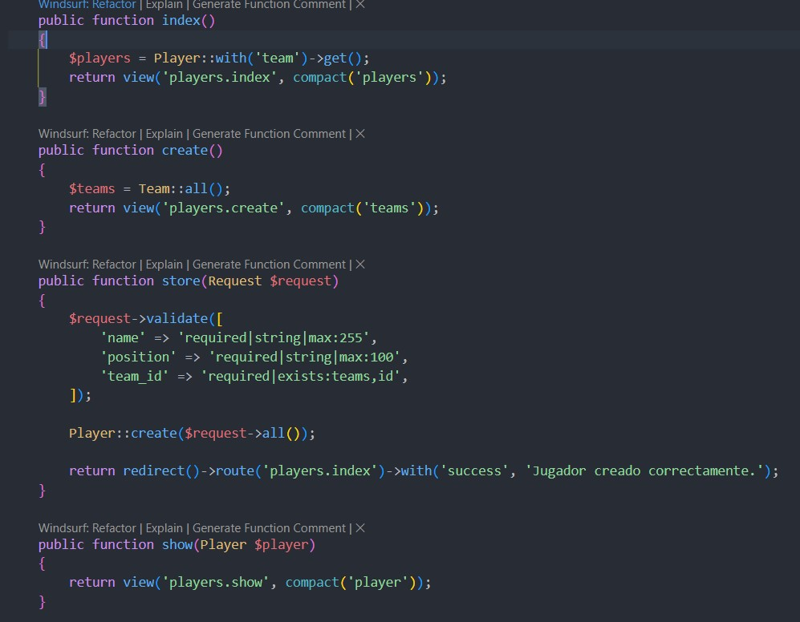

> ```php
>    $players = Player::with('team')->get();
> ```
>
> Obtiene todos los jugadores (***Player***) con sus equipos (***with('team'***) carga la relación).
>
> ---
>
> ```php
> Player::create($request->all());
> ```
>
> Crea un nuevo jugador usando todos los datos recibidos.

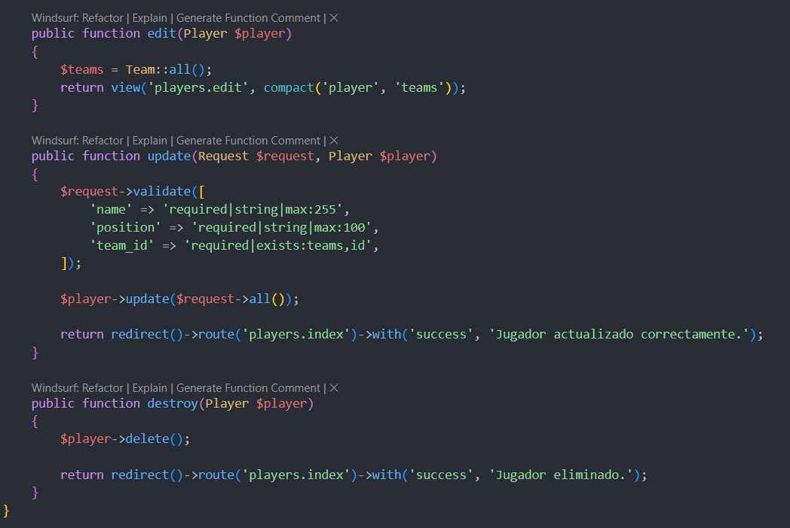

> En la funcion ***edit***, cargamos los datos del jugador para editar y también carga todos los equipos para que puedas cambiarle el equipo si quieres.

## **5. Rutas y Navegación**

* **Definir Rutas** :
  Las rutas para el CRUD de equipos y jugadores se definen usando `Route::get`, lo que automáticamente genera todas las rutas necesarias para las operaciones CRUD.

```php
// Ruta de inicio
Route::get('/', function () {
    return redirect()->route('teams.index');
});

// CRUD Equipos
Route::resource('teams', TeamController::class);

// CRUD Jugadores
Route::resource('players', PlayerController::class);

```

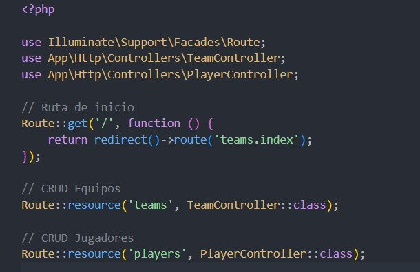

* **Barra de Navegación** :
  Se crea una barra de navegación en el layout principal `app.blade.php` con enlaces a las secciones de equipos y jugadores.

```php
<nav class="navbar navbar-expand-lg navbar-dark bg-dark">
    <a class="navbar-brand" href="{{ url('/') }}">🏀 Basketball App</a>
    <ul class="navbar-nav">
        <li class="nav-item"><a class="nav-link" href="{{ route('teams.index') }}">Equipos</a></li>
        <li class="nav-item"><a class="nav-link" href="{{ route('players.index') }}">Jugadores</a></li>
    </ul>
</nav>
```

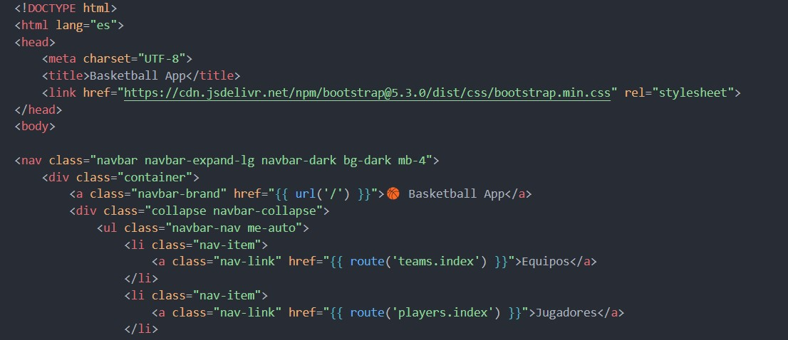

## **6. Vistas y Formularios**

* **Vistas para los CRUD** :
  Se crearon vistas Blade para mostrar los equipos y jugadores, y para proporcionar formularios para crear y editar.
  Ejemplo de la vista para crear un equipo:

```php
<form action="{{ route('teams.store') }}" method="POST">
    @csrf
    <div class="mb-3">
        <label for="name">Nombre del Equipo</label>
        <input type="text" name="name" required>
    </div>
    <div class="mb-3">
        <label for="city">Ciudad</label>
        <input type="text" name="city" required>
    </div>
    <button type="submit">Crear Equipo</button>
</form>
```

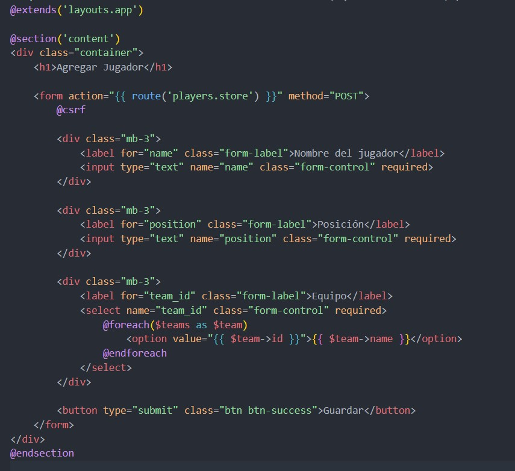

> ***@csrf* ** sus funciones son las siguinetes:
>
> * Instrucción de seguridad para protegerse contra **ataques CSRF** (Cross-Site Request Forgery).
> * Laravel genera un token automáticamente para validar que el formulario viene de la misma app.
>
> ---
>
> **Botón de guardar:**
>
> ```html
> <button type="submit" class="btn btn-success">Guardar</button>
> ```
>
>
> ➔ Botón verde (por la clase Bootstrap ***btn-success***) que envía el formulario.
>

## **7. Estilos Personalizados**

* **CSS** :
  Se añadió un archivo CSS personalizado para mejorar la apariencia visual, utilizando un diseño limpio y moderno:

```css
body {
    font-family: Arial, sans-serif;
    background-color: #f5f5f5;
}
.navbar {
    background-color: #333;
}
.container {
    max-width: 900px;
}
```

Luego lo cambiamos por un archivo de boostrap que nos gustó.

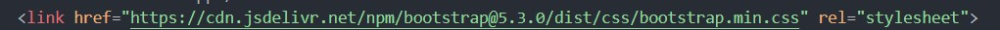

## **8. Validación y Mensajes de Éxito**

* **Mensajes Flash** :
  Se implementaron mensajes flash para indicar el éxito de las operaciones, como la creación de un equipo o jugador, usando:

```php
return redirect()->route('teams.index')->with('success', 'Equipo creado con éxito!');
```

## 9. Autor

Antonio Sillero Ortiz
