# 🏀 Basketball API REST con Laravel

## 1. Introducción

Este proyecto utiliza Laravel para crear una API RESTful que gestiona jugadores y equipos de baloncesto. Se implementan modelos, migraciones, relaciones, validaciones, recursos y controladores necesarios para un CRUD completo de las entidades `Player` y `Team`.

---

## 2. Creación del Proyecto y Configuración Inicial

Utilizamos el proyecto del tema anterior (TEAM 6 Seeder, Faker y Factory), nos vamos a la ruta del proyecto e instalamos API:

```php
php artisan install:api
```

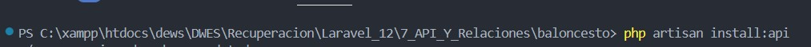

---

## 3.Relaciones (Tabla Pivote) N:M

En la relacion trataremos de que los jugadores(**players**) puedan cambiarse de equipo(**team**) por lo cual debemos hacer una relacion **N:M** ya que muchos equipos pueden tener muchos jugadores y los jugadores pueden trasladarse a muchos equipos.

Empezamos creando la migracion de la tabala pivote (**equipo_jugador_table**).

```php
php artisan make:migration create_equipo_jugador_table
```

Y vamos a rellenar los campos:

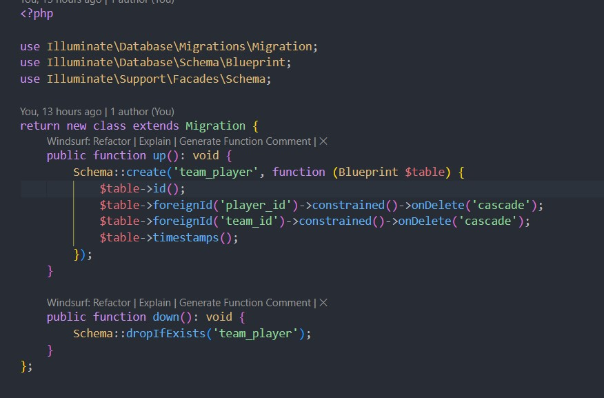

`--> constrained(): Laravel asume que hace referencia a la tabla players y su campo id.`

`--> onDelete('cascade'): Si se elimina un jugador, se eliminan también sus registros en team_player. `

Tas crear las migraciones el siguiente punto es crear el controlador(**TeamPlayerController**).

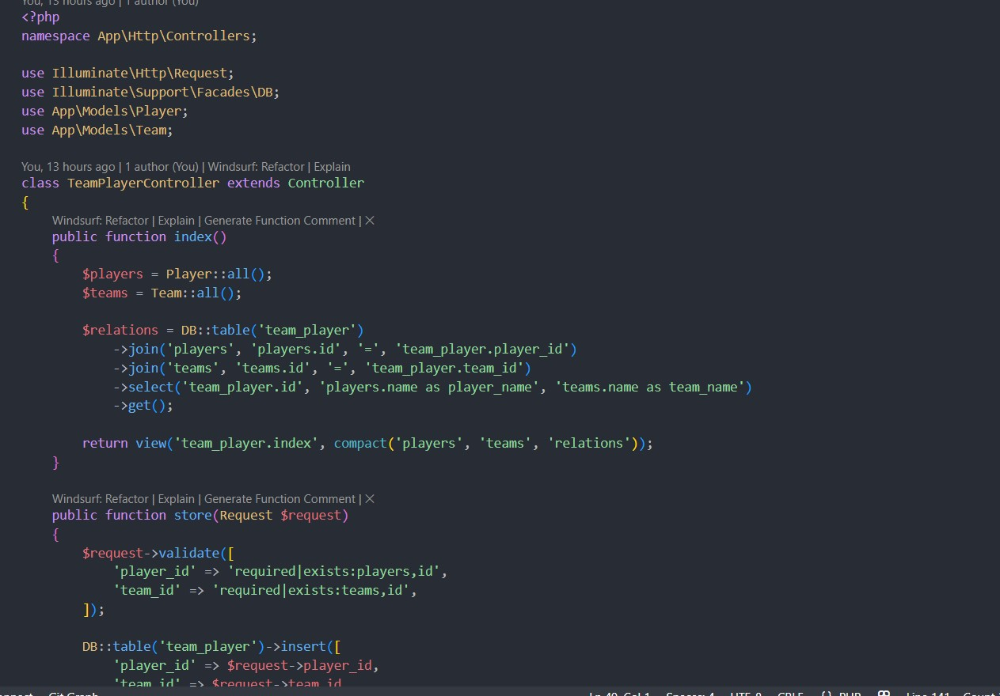

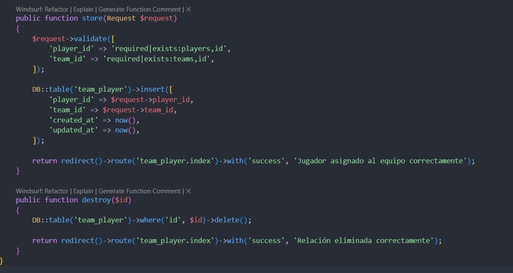

Como resultado final:

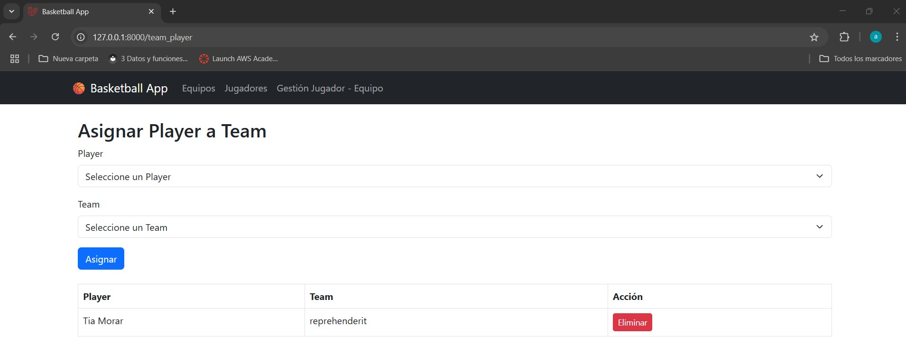

---

## 4. Relaciones entre Modelos

### En `Team.php`

```php
 public function players(): BelongsToMany
    {
        return $this->belongsToMany(Player::class, 'team_player', 'team_id', 'player_id')
            ->withTimestamps();
    }
```

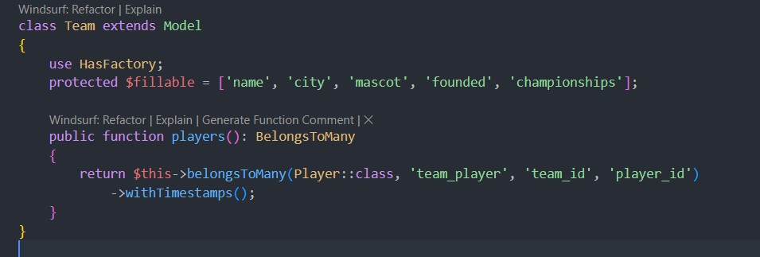

### En `Player.php`

```php
 public function team(): BelongsToMany
    {
        return $this->belongsToMany(Team::class, 'team_player' , 'player_id', 'team_id')
            ->withTimestamps();
    }
```

---

## 5. Rutas API

Creamos y editamos el archivo `routes/api.php`:

```php
Route::apiResource('teams', TeamController::class);
Route::apiResource('players', PlayerController::class);
```

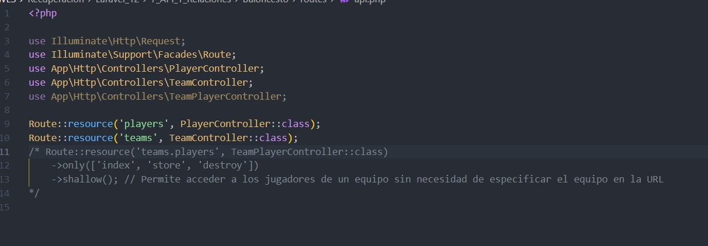

---

## 6. Controladores

Modificamos los controladores:

Cada uno debe implementar los métodos: `index`, `store`, `show`, `update`, `destroy`.

**TeamController**

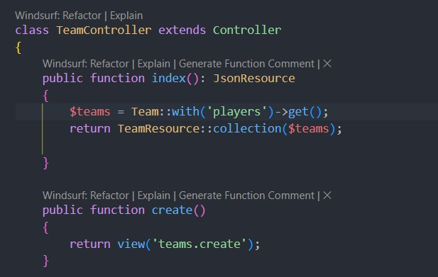

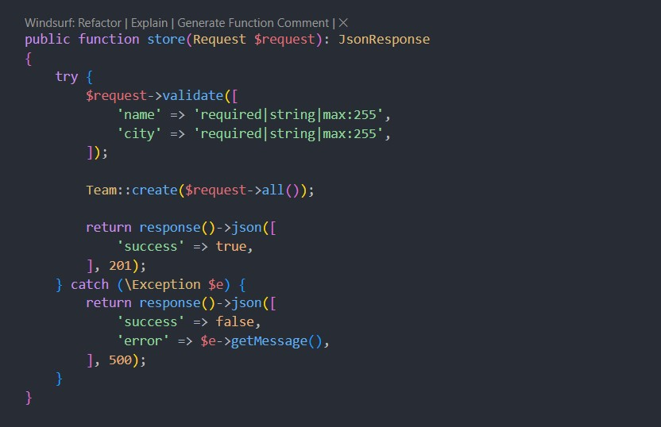

`Devuelve una respuesta JSON con:`

`Código 201 si fue exitoso.`

`Código 500 si ocurrió una excepción.`

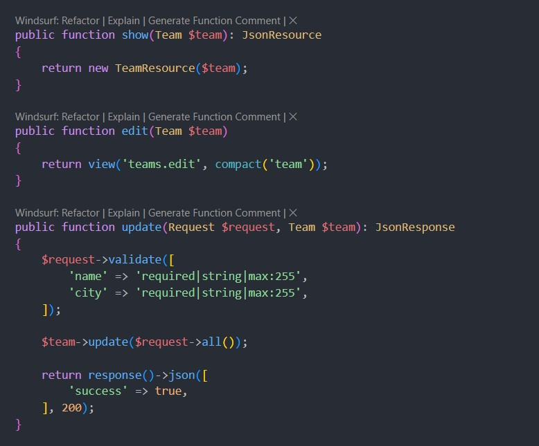

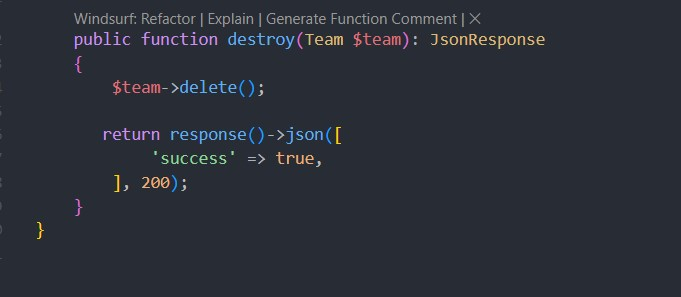

---

## 7. Validaciones con Form Requests

Crear los requests:

```php
php artisan make:request TeamRequest
php artisan make:request PlayerRequest
```

### Ejemplo de reglas para Team:

```php
 public function rules(): array
    {
        return [
            'name' => 'required|string|max:255',
            'city' => 'required|string|max:100',
            'founded' => 'required|date_format:Y-m-d', // Fecha de fundación en formato YYYY-MM-DD  
        ];
    }
```

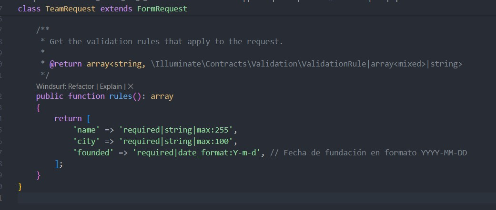

---

## 8. API Resources

Crear resources:

```bash
php artisan make:resource TeamResource
php artisan make:resource PlayerResource
```

### Ejemplo de TeamResource:

```php
public function toArray(Request $request): array
    {
        return [
            'id' => $this->id,
            'name' => $this->name,
            'city' => $this->city,
            'mascot' => $this->mascot,
            'founded' => $this->founded,
            'championships' => $this->championships,
            'players' => PlayerResource::collection($this->whenLoaded('players')),
        ];
    }
```

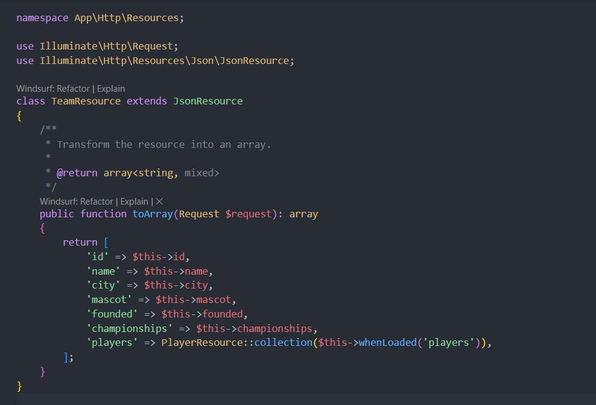

---

## 9. Pruebas con Thunder Client / Postman

### * Probar endpoints como:

* `GET /api/teams`

  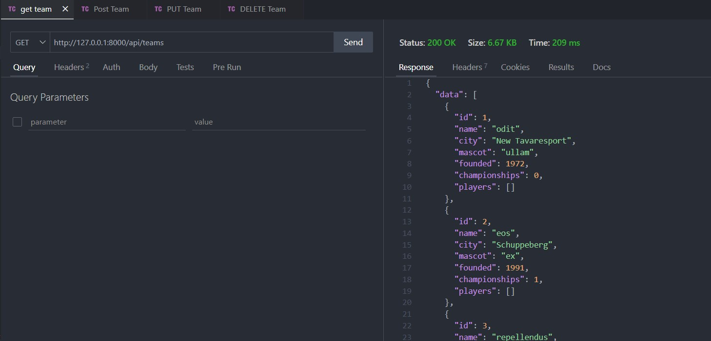
* `POST /api/teams`

  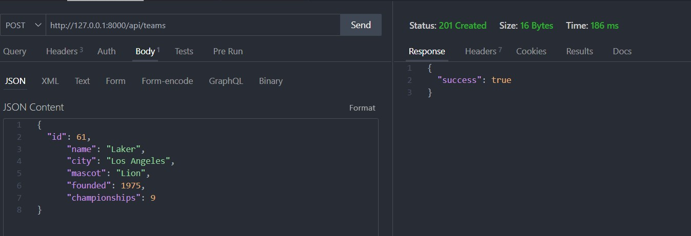
* `PUT /api/teams/61`

  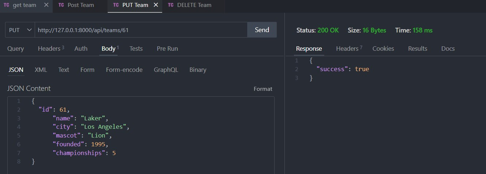
* `DELETE /api/teams/61Ç`

  
* **Asegurarse de usar formato JSON.**

  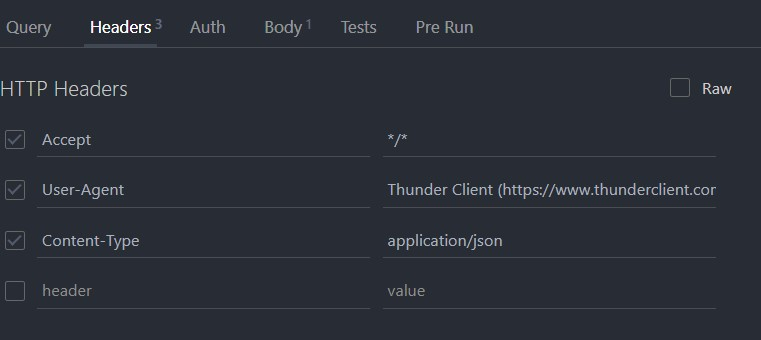
