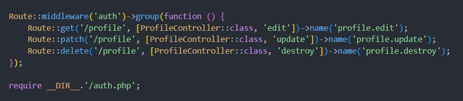

# 🏀 Proyecto Baloncesto - Laravel 12 + Breeze + Middleware

Proyecto base en Laravel 12 con autenticación Breeze y un **middleware personalizado** para proteger rutas de la API. Ideal como base para sistemas más complejos de autorización y autenticación.

---

## ⚙️ Tecnologías

* Laravel 12
* Laravel Breeze (API)
* Sanctum
* Middleware personalizado

---

## 🚀 Instalación

Utilizamos el proyecto anterior de API y Relaciones

```php
git clone <repositorio>
cd <carpeta>
composer install
cp .env.example .env
php artisan key generate
php artisan migrate
npm install && npm run dev
php artisan serve
```

---

## 🔐 Autenticación

Se utiliza **Laravel Breeze API** con **Sanctum** para autenticación vía tokens.

```php
php artisan breeze:install api
php artisan migrate
```

Rutas incluidas:

```php
POST /register
POST /login
GET /user        (requiere token)
POST /logout     (requiere token)
```

---

## 🔒 Rutas protegidas

Laravel protege automáticamente las rutas con middleware `auth:sanctum`.

### Ejemplo:



## 🧪 Pruebas rápidas (con Thunder Client)

1. **POST** `/register`

   → Guarda el token de la respuesta
2. **GET** `/dashboard`

   → Agrega header:

   `Authorization: Bearer TU_TOKEN`

## ✅ Notas

* No se usan middlewares personalizados.
* Toda la protección se basa en `auth:sanctum`.
* Breeze ya incluye lo necesario para login/register/logout.
