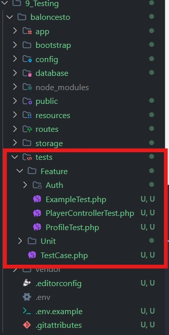
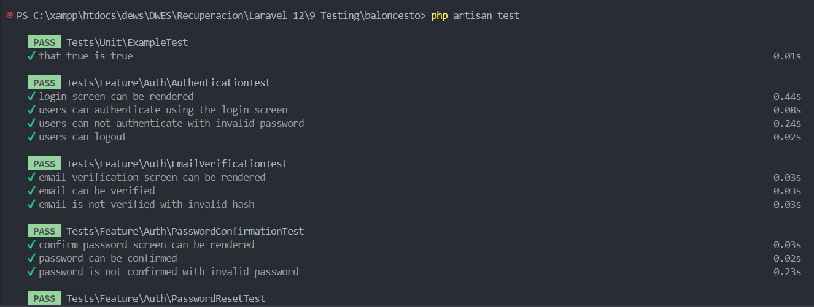
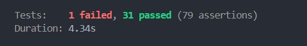

# 🧪 Laravel Testing Project

Este proyecto Laravel incluye pruebas automatizadas usando **PHPUnit** bajo una estrategia **TDD (Test-Driven Development)**. El objetivo es asegurar el correcto funcionamiento de endpoints y lógica del sistema a través de tests **unitarios** y **de integración**.

---

## 🚀 Tecnologías

- Laravel 12
- PHPUnit (Testing Framework)

### 🧪 Paso 1: Crear archivo de prueba

```php
php artisan make:test PlayerControllerTest
```



---

### 🧪 Paso 2: Estructura base del test

```php
<?php

namespace Tests\Feature;

use Tests\TestCase;
use App\Models\Player;
use Illuminate\Foundation\Testing\RefreshDatabase;

class PlayerControllerTest extends TestCase
{
    use RefreshDatabase;

    // 1. Ver listado
    public function test_index_displays_players()
    {
        $players = Player::factory()->count(3)->create();

        $response = $this->get(route('players.index'));

        $response->assertStatus(200);
        $response->assertViewIs('players.index');
        $response->assertViewHas('players', function ($viewPlayers) use ($players) {
            return $viewPlayers->count() === $players->count();
        });
    }

    // 2. Mostrar un jugador
    public function test_show_displays_single_player()
    {
        $player = Player::factory()->create();

        $response = $this->get(route('players.show', $player));

        $response->assertStatus(200);
        $response->assertViewIs('players.show');
        $response->assertViewHas('player', $player);
    }

    // 3. Formulario de creación
    public function test_create_displays_form()
    {
        $response = $this->get(route('players.create'));

        $response->assertStatus(200);
        $response->assertViewIs('players.create');
    }

    // 4. Almacenar jugador válido
    public function test_store_creates_player_and_redirects()
    {
        $data = ['name' => 'Test Player'];

        $response = $this->post(route('players.store'), $data);

        $response->assertRedirect(route('players.index'));
        $this->assertDatabaseHas('players', $data);
    }

    // 5. Formulario de edición
    public function test_edit_displays_form_with_player()
    {
        $player = Player::factory()->create();

        $response = $this->get(route('players.edit', $player));

        $response->assertStatus(200);
        $response->assertViewIs('players.edit');
        $response->assertViewHas('player', $player);
    }

    // 6. Actualizar jugador válido
    public function test_update_updates_player_and_redirects()
    {
        $player = Player::factory()->create();
        $newData = ['name' => 'Updated Name'];

        $response = $this->put(route('players.update', $player), $newData);

        $response->assertRedirect(route('players.index'));
        $this->assertDatabaseHas('players', ['id' => $player->id, 'name' => 'Updated Name']);
    }

    // 7. Eliminar jugador
    public function test_destroy_deletes_player_and_redirects()
    {
        $player = Player::factory()->create();

        $response = $this->delete(route('players.destroy', $player));

        $response->assertRedirect(route('players.index'));
        $this->assertDatabaseMissing('players', ['id' => $player->id]);
    }
}

```

#### ¿Para que hemos creado este test?

El test sirve para **verificar que el controlador `PlayerController` funcione correctamente** en diferentes escenarios comunes de una aplicación CRUD (Crear, Leer, Actualizar, Eliminar) para el modelo `Player`

---

### 🧪 Paso 3: Ejecuta las pruebas

```php
php artisan test
```




