# Blade

Iniciaremos la practica en **/resources/views** creando:

* about
* contact
* index
* services

con la misma estructura que el ejercicio anterior (Hello World de fundamentos)

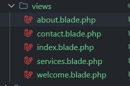

A continuación modificamos el archivo **/routes/web**

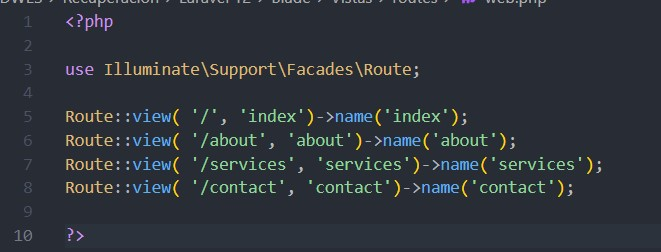

## Plantillas

Como podemos comprobar las vistan comparten gran parte del codigo, por loq ue vamos a utilizar plantillas para poder evitar repeticiones.Para ello iremos a las vistas y crearemos una carpeta llamada **layout**.

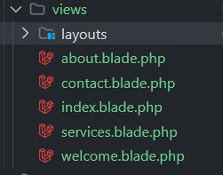

Ahora crearemos un nuevo archivo **/views/layouts/landing,blade.php**, que será el nombre de nuestra plantilla.

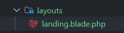

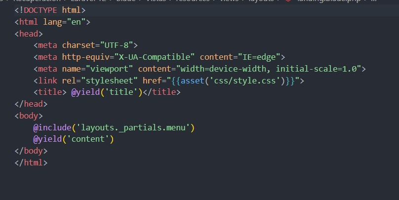

En este ejemplo, creamos las secciones con **@yield** para que las vistas las completen:

* title , para el título
* content, para el body

## Parciales

A continuación creamos la carpeta  **_partials** y un archivo llamado **menu.blade.php** dentro de layouts, dentro de ellla crearemos un menu, para poder navegar entre las vistas:

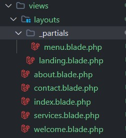

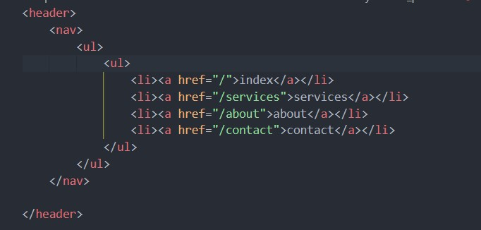

## Componentes Blade

La inclusión del menu.blade no contiene ninguna parte que pueda ser modificada o partes distintas al archivo que lo está llamado, como hicimos con @yield y @section...

Ahora queremos hacer lo mismo pero en vez de como elementos padre, como componentes hijo. Para ello se usan los componentes.

Vemos un ejemplo con la vista Services y un sistema de tarjetas.

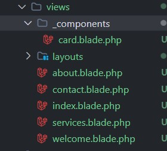

Rellenaremos el archivo card.blade.php con lo siguiente:

Tras ello modificamos el **services.blade.php** de la siguiente manera:

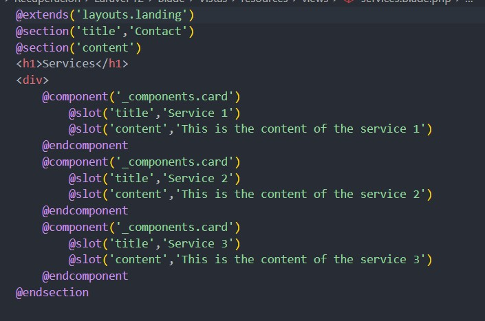

## Public

Vamos a crear un directorio  **assets** , y dentro un directorio llamado **img**, el cual le añadiremos una imagen.

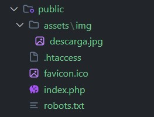

Y lo incluimos en nuestro card haciendo uso de nuestro método estático asset.
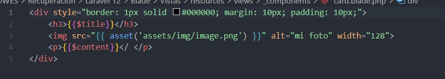

Tambien añadiremos estoilos de CSS creando una carpeta llamada **css** y creamos el archivo **style.css** con un código de estilos.

`/* Estilos generales */
body {
    font-family: 'Poppins', sans-serif;
    background: linear-gradient(135deg, #0a0a0a, #1a001a);
    color: #d1b3ff;
    margin: 0;
    padding: 0;
    overflow-x: hidden;
}

/* Encabezado futurista */
header {
    background: rgba(20, 0, 30, 0.8);
    backdrop-filter: blur(10px);
    padding: 20px;
    text-align: center;
    box-shadow: 0 4px 10px rgba(128, 0, 128, 0.5);
}

header h1 {
    font-size: 2.5rem;
    color: #b266ff;
    text-transform: uppercase;
    letter-spacing: 4px;
    text-shadow: 0 0 15px #b266ff;
}

/* Estilos para los enlaces de navegación */
nav {
    text-align: center;
    padding: 15px 0;
}

nav a {
    color: #d1b3ff;
    text-decoration: none;
    font-size: 1.2rem;
    margin: 0 15px;
    transition: color 0.3s ease-in-out;
}

nav a:hover {
    color: #ff00ff;
    text-shadow: 0 0 10px #ff00ff;
}

/* Botón futurista */
.button {
    display: inline-block;
    padding: 12px 24px;
    background: linear-gradient(90deg, #8a2be2, #ff00ff);
    border: none;
    border-radius: 50px;
    color: white;
    font-size: 1.1rem;
    text-transform: uppercase;
    cursor: pointer;
    transition: all 0.3s ease-in-out;
    box-shadow: 0 0 15px rgba(138, 43, 226, 0.7);
}

.button:hover {
    background: linear-gradient(90deg, #ff00ff, #8a2be2);
    box-shadow: 0 0 25px rgba(255, 0, 255, 0.9);
    transform: scale(1.05);
}

/* Secciones */
section {
    padding: 60px 20px;
    text-align: center;
    border-bottom: 2px solid rgba(255, 0, 255, 0.3);
}

section h2 {
    font-size: 2rem;
    color: #b266ff;
    text-shadow: 0 0 10px #b266ff;
}

/* Footer */
footer {
    background: #0a001a;
    color: #d1b3ff;
    text-align: center;
    padding: 20px;
    font-size: 0.9rem;
}

/* Efecto de neón */
.neon-text {
    font-size: 2rem;
    color: #ff00ff;
    text-shadow: 0 0 10px #ff00ff, 0 0 20px #ff00ff, 0 0 30px #ff00ff;
}

/* Animación para efectos futuristas */
@keyframes glow {
    0% { text-shadow: 0 0 10px #ff00ff; }
    50% { text-shadow: 0 0 20px #ff00ff; }
    100% { text-shadow: 0 0 10px #ff00ff; }
}

.glow {
    animation: glow 1.5s infinite alternate;
}
`

Y muy imporatante es que lo añadamos a **landing.blade.php**.

## Resultado

Ahora mostraremos el resultado:

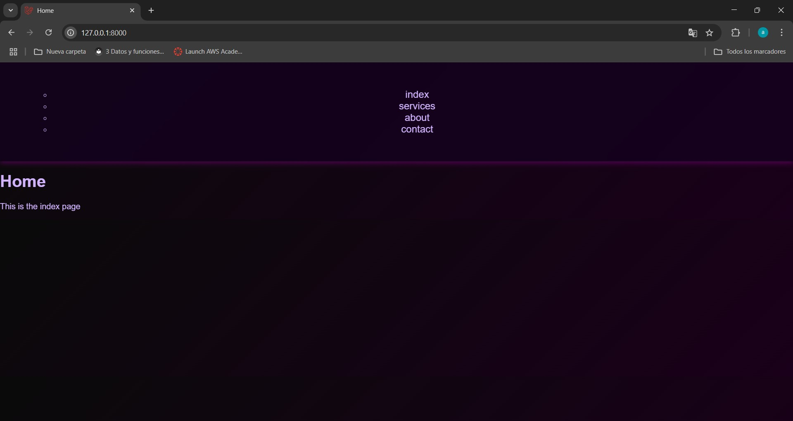

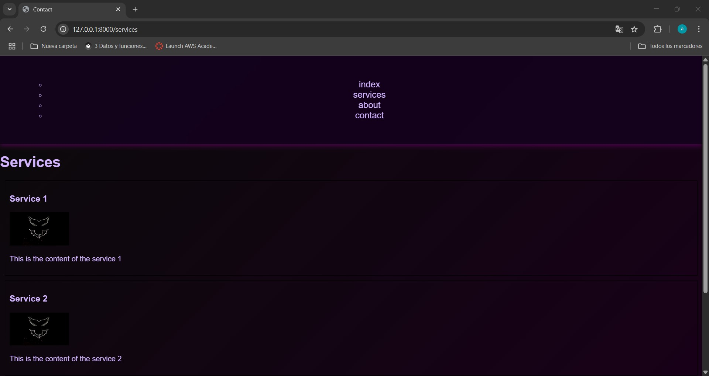
