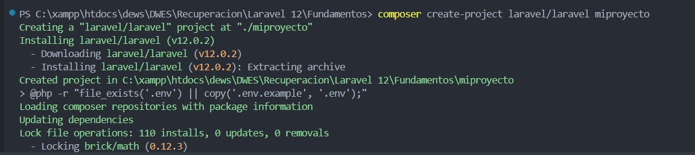
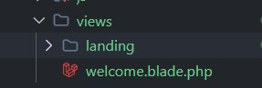
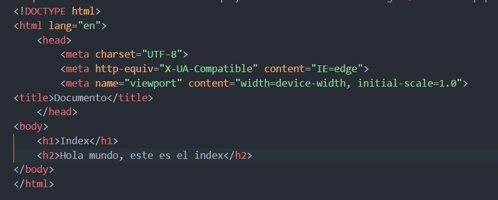
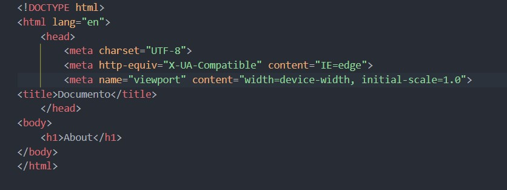
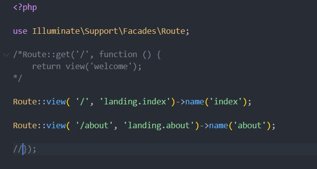
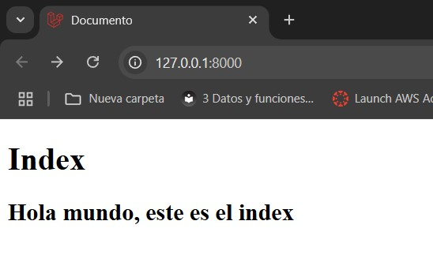
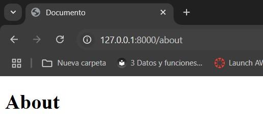

# Fundamentos Laravel 12

## Novedades Laravel 12

### 1. Rendimiento y escalabilidad mejorados

Laravel 12 introduce optimizaciones en el enrutamiento, reduciendo la sobrecarga y mejorando los tiempos de respuesta. Además, se han mejorado los mecanismos de almacenamiento en caché, con mejor soporte para Redis y Memcached, y una compatibilidad asincrónica optimizada para un mejor manejo de operaciones de E/S.

### 2. Inyección de dependencia optimizada

El sistema de inyección de dependencias ha sido refinado para reducir el código repetitivo y mejorar la legibilidad. Ahora, Laravel 12 resuelve automáticamente dependencias en acciones de controladores y rutas, simplificando la gestión de servicios.

### 3. Experiencia de desarrollador mejorada

Se han implementado mejoras en el manejo de errores, proporcionando mensajes más informativos. Blade ha recibido nuevas directivas y mejor compatibilidad con componentes. Además, la integración con IDEs como PHPStorm y VS Code se ha optimizado.

### 4. Mejoras en el generador de consultas avanzadas

La sintaxis del generador de consultas es ahora más fluida, permitiendo la construcción dinámica de consultas. Se ha mejorado el soporte para subconsultas y la compatibilidad con bases de datos como MySQL, PostgreSQL y SQLite.

### 5. Mejoras de seguridad

Laravel 12 refuerza la autenticación con soporte nativo para autenticación multifactor (MFA). Se han optimizado los mecanismos de hash de contraseñas y mejorado la protección CSRF con opciones más flexibles.

### 6. Andamiaje frontend modernizado

Se ha mejorado la compatibilidad con Tailwind CSS y la integración con Livewire y Alpine.js, facilitando la creación de interfaces dinámicas sin necesidad de JavaScript adicional.

### 7. Desarrollo mejorado de API

Se han implementado mejoras en la limitación de velocidad de las API, compatibilidad con versiones y herramientas de documentación más avanzadas, facilitando la administración y mantenimiento de las API.

### 8. Herramientas de prueba y depuración mejoradas

La integración con PHPUnit se ha optimizado, permitiendo un mejor soporte para simulaciones y coberturas de pruebas. Laravel 12 también introduce nuevas herramientas para facilitar la depuración y el registro de errores.

### 9. Mejora de la localización e internacionalización

Se ha mejorado el soporte para cambios dinámicos de idioma, la gestión de traducciones y la configuración regional, permitiendo una experiencia de usuario más personalizada.

### 10. Funciones avanzadas de ORM de Eloquent

Se han introducido mejoras en la gestión de relaciones, carga ansiosa optimizada y nuevos mutadores personalizados para transformar datos de manera más eficiente.

### 11. Gestión mejorada de trabajos y colas

Laravel 12 permite un agrupamiento de trabajos más avanzado y una priorización de colas más flexible, mejorando la eficiencia en el procesamiento de tareas en segundo plano.

### 12. Integración moderna de DevOps

Se ha mejorado la compatibilidad con Docker, CI/CD y herramientas de Infraestructura como Código (IaC), facilitando la automatización y escalabilidad de las aplicaciones.

### 13. Nuevas funciones de la consola Artisan

Artisan incorpora mejoras en la creación de comandos personalizados, un modo interactivo y opciones de programación avanzadas para tareas automatizadas.

### 14. Documentación y recursos de aprendizaje mejorados

La documentación ha sido ampliada y se han introducido tutoriales interactivos para facilitar el aprendizaje de Laravel 12.

## Fuentes

[Laravel](https://laravel.com/docs/12.x/upgrade)

[Linkedin](https://www.linkedin.com/pulse/novedades-de-laravel-12-césar-hans-cancino-zapata-vmpqf/)

[CursosDesarrolloWeb](https://www.cursosdesarrolloweb.es/blog/novedades-laravel-12)

# Creación del proyecto

```
composer create-project laravel/laravel miproyecto
```



Para iniciar el proyecto utilizamos el siguiente comando:
`php artisan serve`

Acto seguido vamos a ir nos a la carpeta de views y crearemos una subcarpeta llamada **landing**



Ahora crearemos las vistas Index y About:

### Index




### About



Ahora modificaremos el apartado de web, que se encuentra en /route/web



Y como resultado nos debería de mostrar en el navegador nuestras vistas:

**Resultado Index**



**Resultado About**


