# Migraciones y Modelos

## Configuración de la Capa de Persistencia

Creamos un nuevo proyecto sin starter kit:

```php
laravel new basketdb
```

Donde nosotros ponemos basketdb, cada persona puede poner el nombre que quiere.

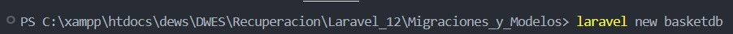

Elegimos no tener starter kit:

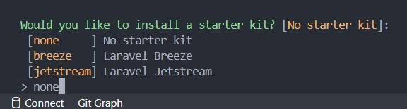

Ahora escogemos el el framework:

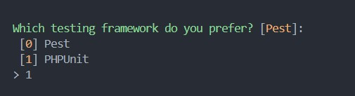

Uno de los passos mas importantes es la elección de la base de datos:
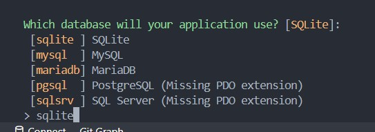

Además en el proceso de creación nos da la opcion de cargar las migraciones directamente.

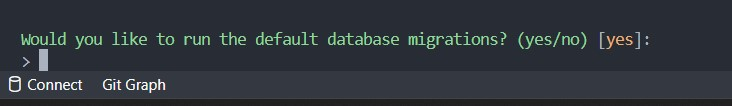

Si no hemos aceptado las migraciones iniciales en la creación del proyecto debemos ejecutar el siguiente comando para obtenerlas:

```php
php artisan migrate
```

Ya lo hayas hecho en la elección de la instaclación del proyecto o mediante el comando anterior tendriamos que obtener las migraciones siguientes:

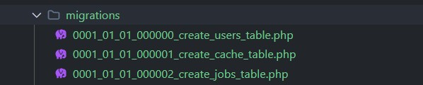

## Migraciones

Generamos una migración para jugadores:

```php
php artisan make:migration create_players_table
```

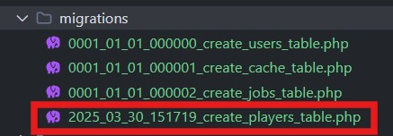

Editamos el archivo **database/migrations/**:

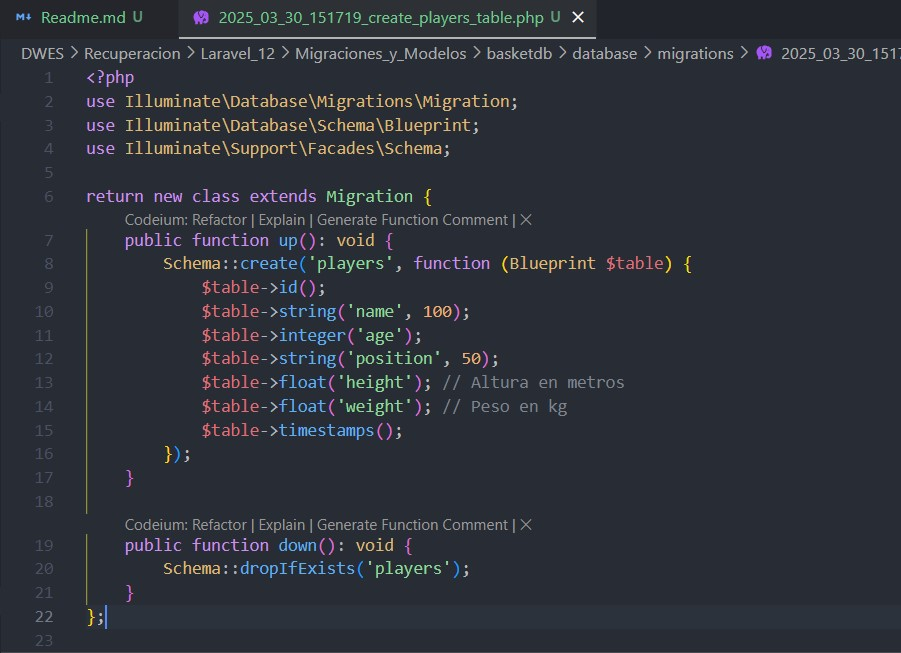

### Datos importantes

* **up:** Info para crear la tabla
* **down:** info para borrar esa migración y hacer rollback
* **Blueprint** es una clase que contiene todos los métoodos para generar la estructura de la tabla

La clase **schema** puede crear todos los elementos de la tabla.

* create
* table
* dropIfExists

### Nomenclatura de las tablas

**Es IMPORTANTE que para que funcione bien automatizado las tablas se escriban en plural y todo en minúscula**

Ejecutamos la migración:

```php
php artisan migrate
```

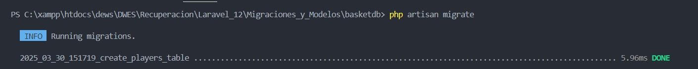

## Rollback y Modificación de Migraciones

Si olvidamos un campo. usamos el comando rollback:

### Lo que NO se debe hacer:

Tocar las tablas directamente en la base de datos. No demos manipular el sistema de datos.

### Rollback

Estas son nuestras migraciones:

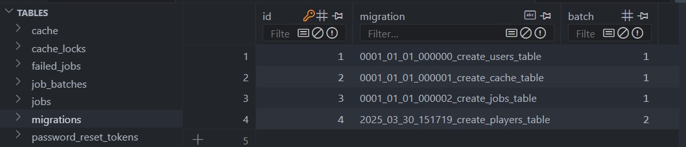

Al crear una nueva migración aparece en el lote 2, pero si utilizamos el comando:

```php
php artisan migrate:rollback
```

Nos elimina la ultima migración lo cual desaparece el lote 2 y la tabla players.

### Tipos de Rollback

1. `php artisan migrate:reset` para borrar todas las migraciones
2. `php artisan migrate:rollback --batch=1`
3. `php artisan migrate:refresh` para borrar las migraciones y volver a migrar

### Update table

Para modificar una tabla sin perder datos, generamos una nueva migración:

```php
php artisan make:migration update_player_table
```

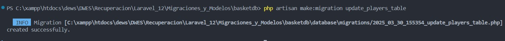

Podemos comprobarlo en las migraciones que está creada:
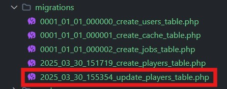

Editamos la migracion para hacer que se modifique:
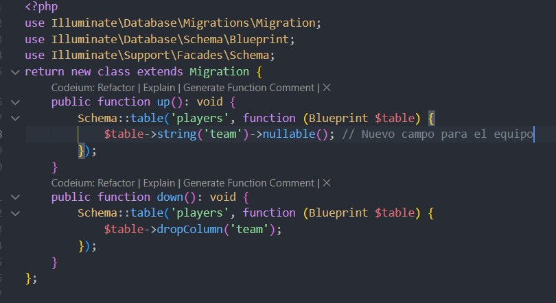

Una vez hayamos editado el achivo ejecutamos la nueva migración:

```php
php artisan migrate
```

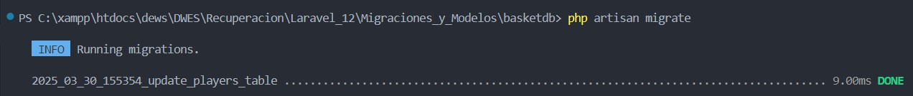

## Modelos Laravel

Generamos el modelo:

```php
php artisan make:model Player
```

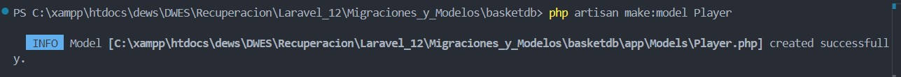

Editamos **app/Models/Player.php**:

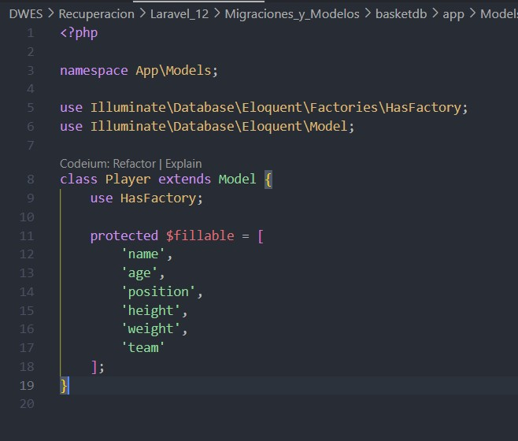

## Fillable, Guard, Cast y Hidden

### fillable

* Lista blanca (Solo estas se pueden asignar en msa).
* Protege contra asignación masiva no deseada.

### guarded

* Lista negra (estos no se pueden asignar en masa).
* Si está vacío (`[]`), significa que todos los campos son asignables.

### casts

* Convierte tipos de datos automáticamente
* Útil para manejar fechas, JSON, booleanos, etc.

### hidden

* Oculta atributos en respuestas JSON
* Útil para ocultar contraseñas u otros datos sensibles.

## Atajos mas comunes en la Creación de Modelos y migraciones

Generamos el modelo y la migración al mismo tiempo:

```php
php artisan make:model Team --migration
```

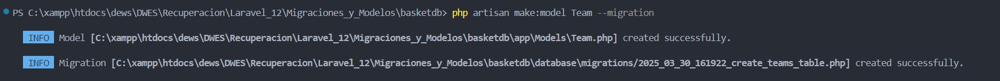

Y como podemos ver nos ha creado el modelo con su migración correspondinete, con lo datos default, esto nos ahorra mucho tiempo a la hora de programar.

Más atajos de creación sacados de la documentación de laravel.

* **`php artisan make:model NombreDelModelo -m`** → Crea un modelo y su migración asociada.
* **`php artisan make:model NombreDelModelo -c`** → Crea un modelo y un controlador.
* **`php artisan make:model NombreDelModelo -r`** → Crea un modelo y un controlador con rutas tipo resource.
* **`php artisan make:model NombreDelModelo -f`** → Crea un modelo y su fábrica.
* **`php artisan make:model NombreDelModelo -s`** → Crea un modelo y un seeder.
* **`php artisan make:model NombreDelModelo -a`** → Crea un modelo con su migración, controlador, fábrica y seeder.
